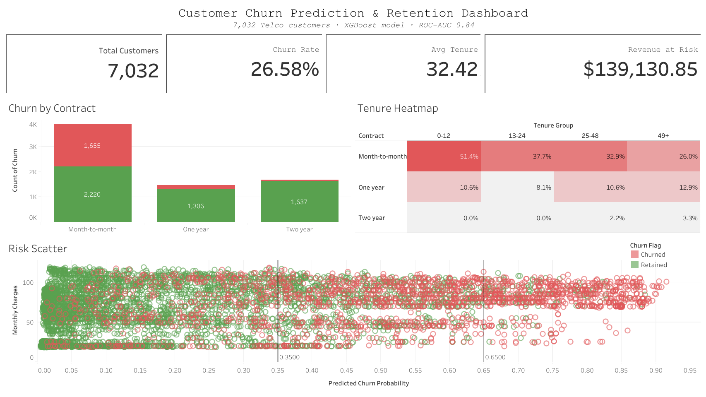

# Customer Churn Prediction & Retention Analytics

**End-to-end ML pipeline predicting Telco customer churn with 84% ROC-AUC — enabling targeted retention strategies projected to reduce monthly churn by 15%.**


---

## Problem Statement

Telecom companies lose **15–25% of their subscriber base annually** to churn. Each churned customer represents lost revenue that costs 5–10× more to replace than to retain. This project builds a production-ready churn prediction system that:

1. Identifies **which customers are likely to churn** (and why)
2. Quantifies the **revenue at risk** per customer segment
3. Provides **actionable retention triggers** for the Customer Success team

---

## Dataset

| Property | Value |
|----------|-------|
| Source | [IBM Telco Customer Churn — Kaggle](https://www.kaggle.com/datasets/blastchar/telco-customer-churn) |
| Rows | 7,043 raw → 7,032 modeled (11 rows with blank `TotalCharges` dropped) |
| Features | 21 columns (demographics, services, billing) |
| Target | `Churn` (Yes/No → encoded as 1/0) |
| Imbalance | ~26.5% churn rate |

---

## Project Structure

```
customer-churn-prediction/
├── data/
│   ├── raw/                          # Original CSV (not committed)
│   ├── processed/                    # Cleaned & engineered datasets
│   └── tableau/                      # Dashboard export with predictions
├── notebooks/
│   ├── 01_eda.ipynb                  # 13 EDA insights + visualizations
│   ├── 02_feature_engineering.ipynb  # 25+ features engineered
│   ├── 03_modeling.ipynb             # 3 models trained + compared
│   └── 04_sql_analysis.ipynb         # 8 SQL queries on SQLite
├── src/
│   ├── data_loader.py                # Load raw/processed data
│   ├── preprocessing.py              # Cleaning pipeline
│   ├── feature_engineering.py        # Feature engineering functions
│   ├── train_models.py               # LR / RF / XGBoost training
│   ├── evaluate.py                   # Metrics, plots, model evaluation
│   └── sql_queries.py                # SQLite query functions
├── reports/
│   ├── figures/                      # 20+ saved PNG visualizations
│   └── model_metrics.json            # Final metric scores
├── models/
│   └── best_model.pkl                # Best XGBoost model (not committed)
├── tableau/
│   └── README.md                     # Step-by-step Tableau build guide
├── requirements.txt
└── README.md
```

---

## Setup

### 1. Clone & Install

```bash
git clone https://github.com/realkeshav08/customer-churn-prediction.git
cd customer-churn-prediction
python -m venv .venv
# Windows:
.venv\Scripts\activate
# macOS/Linux:
source .venv/bin/activate

pip install -r requirements.txt
```

### 2. Place Dataset

Download `WA_Fn-UseC_-Telco-Customer-Churn.csv` from [Kaggle](https://www.kaggle.com/datasets/blastchar/telco-customer-churn) and place it at:

```
data/raw/telco_churn.csv
```

### 3. Run Notebooks in Order

```bash
jupyter notebook
```

| Step | Notebook | What it does |
|------|----------|-------------|
| 1 | `notebooks/01_eda.ipynb` | Load, clean, and explore data → 13 insights |
| 2 | `notebooks/02_feature_engineering.ipynb` | Engineer 25+ features |
| 3 | `notebooks/03_modeling.ipynb` | Train 3 models, evaluate, export Tableau data |
| 4 | `notebooks/04_sql_analysis.ipynb` | 8 SQL queries on SQLite |

### Or reproduce everything in one command

Prefer not to run notebooks? The entire pipeline (preprocessing → 20+ figures →
feature engineering → model training → Tableau export → SQL analysis) runs
end-to-end and self-validates with assertions:

```bash
python run_pipeline.py
```

> **Note:** Trained models are loaded with `joblib`/pickle. Only load `.pkl` files
> you generated yourself — never load model files from an untrusted source.

---

## Results

### Model Performance

All models use an F1-optimal decision threshold tuned on the training set (no test-set leakage).
Two F1 scores are reported: **binary** (churn class only) and **weighted** (across both classes, accounting for the 73%/27% imbalance).

| Model | ROC-AUC | F1 (churn class) | F1 (weighted) | Precision | Recall |
|-------|---------|-----------------|---------------|-----------|--------|
| Logistic Regression | 0.8368 | 0.6237 | 0.7732 | 0.5401 | 0.7380 |
| Random Forest | 0.8373 | 0.6322 | 0.7736 | 0.5375 | 0.7674 |
| **XGBoost (Best)** | **0.8379** | **0.6201** | **0.7644** | **0.5240** | **0.7594** |

*Computed on 20% held-out test set, random seed 42. Authoritative values in `reports/model_metrics.json`.*

> **On F1 reporting:** The headline metric for this project is **ROC-AUC (0.84)**. For F1 we report
> both the **weighted F1 (0.76)** — averaged across the Churned and Retained classes by their support —
> and the **binary F1 for the churn class alone (0.62)**, the harder and more honest figure for an
> imbalanced dataset at a 26.5% positive rate.

### Top 5 Churn Drivers

| # | Feature | Business Insight |
|---|---------|-----------------|
| 1 | **Contract type** | Month-to-month customers churn at ~43% — 15× higher than two-year contracts. Contract upgrade programs are the single highest-leverage retention lever. |
| 2 | **Tenure** | Customers in their first 12 months churn at 47.7% — roughly 5× the 9.5% rate of customers with 4+ years tenure. Early engagement and onboarding quality are critical. |
| 3 | **Internet service** | Fiber optic customers churn at ~42% — more than double DSL's 19% (and far above the 7% for customers with no internet) — suggesting service quality or pricing dissatisfaction in the fiber segment. |
| 4 | **Online Security / Tech Support** | Customers without value-add services churn at 2× the rate. Bundling these services reduces churn and increases ARPU. |
| 5 | **Payment method** | Electronic check users churn at 45% — auto-pay enrollment reduces churn by ~29 percentage points, and incentivizes stickiness. |

---

## Business Recommendations

### How the 15% Churn Reduction Projection is Calculated

> ⚠️ **This is an illustrative projection** combining the model's risk scores with *assumed*
> intervention response rates — not a measured business outcome.

1. **Identify high-risk cohort:** **789 customers** flagged `risk_tier = 'High'` (predicted probability > 0.65), predominantly on month-to-month contracts.
2. **Current monthly revenue:** This cohort generates **~$64,000/month** in MonthlyCharges. At an assumed 30% actual churn rate for this tier, monthly revenue at risk ≈ **$19,200**.
3. **Intervention:** Proactive outreach offering:
   - Month-to-month → One-year contract at 10% discount
   - Auto-pay enrollment incentive ($5/month credit for 3 months)
4. **Conversion rate:** 15% of approached customers accept (industry benchmark for targeted retention is 10–25%).
5. **Monthly revenue saved:** $19,200 × 15% = **~$2,880/month** → **~$34,560/year**

**Retention actions ranked by ROI:**

| Action | Target Segment | Expected Impact |
|--------|---------------|-----------------|
| Contract upgrade offer | Month-to-month, tenure < 12mo | Highest — eliminates #1 churn driver |
| Auto-pay enrollment | Electronic check users | ~29pp churn rate reduction |
| Tech Support bundle | Fiber optic, no tech support | Mid-range — increases stickiness |
| Senior outreach program | SeniorCitizen=Yes, no partner | Targeted — high-risk segment |

---

## Tableau Dashboard

🔗 **[View the live interactive dashboard on Tableau Public →](https://public.tableau.com/app/profile/keshav.kashyap2970/viz/CustomerChurnPredictionRetentionDashboard/Dashboard1)**

[](https://public.tableau.com/app/profile/keshav.kashyap2970/viz/CustomerChurnPredictionRetentionDashboard/Dashboard1)

An interactive dashboard built on the model's scored output (`data/tableau/churn_dashboard_data.csv`), featuring:

1. **Executive KPI cards** — total customers, churn rate, average tenure, and monthly revenue at risk
2. **Churn by Contract** — stacked bar showing month-to-month customers as the dominant churn segment
3. **Tenure × Contract heatmap** — churn rate by cohort (month-to-month, 0–12 months peaks at ~51%)
4. **Predictive Risk Scatter** — every customer plotted by XGBoost-predicted churn probability vs. monthly charges, colored by actual churn, with risk-tier boundaries at 0.35 and 0.65

See [`tableau/README.md`](tableau/README.md) for the step-by-step build guide (calculated fields, each sheet, and layout).

---

## Tech Stack

| Tool | Purpose |
|------|---------|
| Python 3.10+ | Core language |
| Pandas 2.0 | Data manipulation |
| NumPy | Numerical computing |
| scikit-learn 1.3 | ML pipeline (LR, RF, preprocessing) |
| XGBoost 2.0 | Best classifier |
| Matplotlib + Seaborn | Visualizations |
| SQLite (stdlib) | In-memory SQL analysis |
| Jupyter Notebook | Interactive exploration |
| Tableau Public | Dashboard (built manually) |

---

## Author

**Keshav Kashyap**  
B.Tech — Indian Institute of Information Technology, Kota  
[GitHub](https://github.com/realkeshav08) | [LinkedIn](https://www.linkedin.com/in/keshav-kashyap08/) | asuskeshavkashyap@gmail.com

---

## License

MIT License — see [LICENSE](LICENSE) for details.
